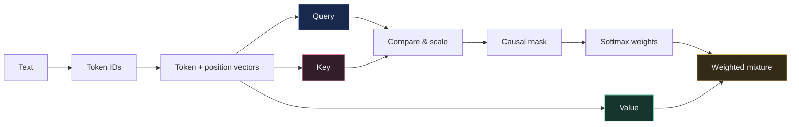

<div align="center">

# Inside the Token


### Understand an LLM, one operation at a time.

An interactive textbook for **tokenization, embeddings, and attention**.<br>
Follow one token through real calculations, then connect the numbers to PyTorch.

**Python 3.13 · PyTorch · FastAPI · Vanilla JavaScript · Runs locally**

[Quick start](#quick-start) · [Learning path](#learning-path) · [How it works](#how-it-works) · [Development](#development)

</div>

---

## Start with “bank,” not a wall of matrices

What happens to one token inside an attention layer? Where does each number come from? Why do we divide by a square root—and what changes when we hide future tokens?

Inside the Token turns those questions into small, interactive lessons inspired by chapters 1–3 of Sebastian Raschka’s *Build a Large Language Model (From Scratch)*.

- **Follow one token.** Select a token, inspect its vectors, and see how its context changes.
- **Open the arithmetic.** Click an output component to reveal the products and sums behind it.
- **Change one thing.** Compare scaled scores, causal masks, dropout draws, and attention heads.
- **Connect it to code.** Expand the math, a focused PyTorch excerpt, or the actual full class.
- **Learn at your pace.** Manual steps, optional checks, saved lesson positions, and a responsive graphite interface.



> **Real arithmetic, clearly labeled examples.** The guided lessons distinguish hand-picked values, the book’s constants, random weights, and trained GPT-2 weights. Toy examples explain the mechanism; they do not demonstrate learned word meanings.

## Quick start

**Requirements:** Git and [uv](https://docs.astral.sh/uv/). The project targets Python 3.13 and CPU-only PyTorch. No frontend build or Node.js installation is needed.

```sh
git clone https://github.com/zakariahere/inside-the-token.git
cd inside-the-token
uv sync --group dev
uv run uvicorn app.main:app --port 8001
```

Open **[http://127.0.0.1:8001](http://127.0.0.1:8001)** and choose a lesson. The commands work in PowerShell and common Unix shells.

<details>
<summary><strong>Optional: the book’s sample text</strong></summary>

```sh
uv run python scripts/fetch_data.py
```

This downloads *The Verdict* to `data/`. Choose it in the input selector, or keep using your own text. Downloaded data is excluded from Git.

</details>

<details>
<summary><strong>Optional: explore trained GPT-2 weights</strong></summary>

Download the checkpoint into the HuggingFace cache:

```sh
uv run python -c "from huggingface_hub import hf_hub_download; hf_hub_download('gpt2', 'model.safetensors')"
```

Then select **Explore → Weights → GPT-2** in the embeddings or multi-head lesson. The attention view exposes the first block’s 12 heads. The checkpoint stays in your local cache and is not part of this repository.

Core lessons work without this download. GPT-2 exploration runs embeddings and one attention block, not a complete text generator.

</details>

## Learning path

| Chapter | Lesson | What you can do |
| :--- | :--- | :--- |
| **1 · The big picture** | What an LLM does | Separate training from generation and locate attention in the model. |
| **2 · Working with text** | Text → tokens | Inspect actual GPT-2 IDs, bytes, Unicode fragments, and decoding. |
| | Inputs & targets | Move a window, shift targets, change stride, and inspect a batch. |
| | Embeddings & position | Look up rows and inspect each component of their sum. |
| **3 · Attention** | Why attention? | Build one context vector from the book’s simplified example. |
| | Queries, keys & values | Project “bank” into three roles, one dot product at a time. |
| | Scores → softmax | Compare scaling, inspect stable softmax, and mix values. |
| | Causal attention | Block future positions and watch the output change. |
| | Dropout & batches | Resample masks, compare evaluation, and follow tensor axes. |
| | Multiple heads | Carry the known single-head pipeline into parallel feature slices, inspect one head’s arithmetic, concatenate, and apply the output projection. |

Each guided lesson offers **See the math**, **See the PyTorch**, and one optional **prediction-and-reveal check**. Explore mode exposes custom text and relevant model controls.

### A small example that stays with you

For the hand-picked sequence `The / bank / river`, bank’s query is `[0, 2]`. Comparing it with all three keys gives raw scores:

```text
                  The    bank    river
bank’s scores      6       6       8
```

From there, the app shows every step: divide by √2, apply softmax, and blend the value vectors. Turn on causal masking and the future token `river` becomes unavailable:

```text
masked scores    [6, 6, −∞]
causal weights   [0.5, 0.5, 0]
```

The numbers are small enough to check by hand. The operations are the same ones used in the larger PyTorch examples.

## How it works

**The browser teaches; Python computes.** A FastAPI backend runs the book’s attention classes and returns intermediate tensors. Small, reusable frontend components display token chips, matrices, attention bars, and arithmetic.

| Layer | Responsibility |
| :--- | :--- |
| `llm_from_scratch/` | Book implementations, trace helpers, and GPT-2 weight mapping |
| `app/` | API validation, tensor serialization, and the hand-picked teaching fixture |
| `frontend/js/textbook/` | Lesson content, state, reusable components, and interactions |
| `frontend/css/textbook.css` | Responsive zakaria.lu-inspired theme and reduced-motion styling |
| `tests/` | Numerical contracts, API checks, reference comparisons, and browser QA notes |

**Numerical details**

- The book’s implementations remain intact; traces check agreement with their forward passes.
- The bank fixture retains full floating-point precision. The original APIs return rounded values; displayed arithmetic is marked approximate where appropriate.
- Future scores use `−∞`; their softmax weights become zero. Dropout operates afterward and does **not** renormalize the surviving weights.
- User text is inserted through text nodes. Byte fragments are displayed without pretending each token is a complete Unicode character.
- Attention text inputs use at most 64 tokens. Larger vectors show a labeled subset of dimensions while Python computes the full result.

<details>
<summary><strong>API reference</strong></summary>

| Endpoint | Purpose |
| :--- | :--- |
| `GET /api/health` | Runtime, sample-data, and GPT-2 cache availability |
| `POST /api/ch02/tokenize` | Token IDs, text previews, bytes, and decoding |
| `POST /api/ch02/windows` | Training pairs and first DataLoader batch |
| `POST /api/ch02/embed` | Token, position, and combined embeddings |
| `POST /api/ch03/simple` | Simplified attention |
| `POST /api/ch03/self` | Trainable Q/K/V attention |
| `POST /api/ch03/causal` | Causal masking and dropout |
| `POST /api/ch03/mha` | Per-head attention and output projection |
| `POST /api/lessons/bank-attention` | Full-precision hand-picked learning example |
| `GET /api/lessons/code` | Actual source of the three attention classes |

The bank endpoint accepts `scaling`, `causal`, `dropout` (0–0.9), `training`, and `seed`. It returns inputs, projection matrices, Q/K/V, intermediate scores, softmax values, dropout masks, weighted contributions, and outputs. JSON represents negative infinity as `"-inf"`.

Open [FastAPI’s interactive API documentation](http://127.0.0.1:8001/docs) while the app is running.

</details>

## Development

```sh
# Reload the backend as Python files change
uv run uvicorn app.main:app --port 8001 --reload

# Run the numerical and API tests
uv run pytest -q
```

Refresh the browser after frontend edits. No bundle step is required.

The latest local verification passed **45 tests**, including the original book-value and GPT-2 reference checks. GPT-2 tests skip when the checkpoint is unavailable; their first run may also need tokenizer/config assets from HuggingFace.

Browser checks cover all 44 guided steps, Explore views, arithmetic selection, scaling, dropout, Unicode text, error recovery, saved progress, and desktop/tablet/mobile layouts. See [the browser acceptance record](tests/browser-qa.md) for details and testing limits.

### Branches

| Branch | Version |
| :--- | :--- |
| **`master`** | Default branch: the interactive textbook |
| `codex/inside-the-token` | Development branch for the textbook redesign |

The original scene-based app remains available in Git history at commit `e28dc90`.

The original frontend modules remain in the tree for reference; the textbook entrypoint does not import them. Existing `#ch03-self` style links map to the replacement lessons.

## Credits & scope

This independent learning companion builds on Sebastian Raschka’s [LLMs-from-scratch](https://github.com/rasbt/LLMs-from-scratch) material and uses [PyTorch](https://pytorch.org/), [tiktoken](https://github.com/openai/tiktoken), and GPT-2 weights from HuggingFace. Its graphite-and-electric-blue visual language and hoodie guide come from [Zakaria’s portfolio](https://zakaria.lu/).

It covers the path through causal multi-head attention. Full transformer blocks, pretraining, fine-tuning, and complete text generation belong to later chapters.
